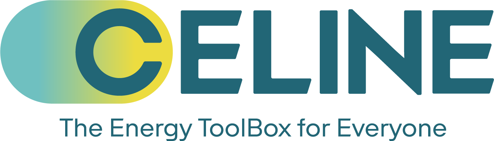

# CELINE Project

    

**CELINE** is driving the digital transformation of energy communities across Europe — making local energy smarter, greener, and more inclusive. 
At its core is a **Digital Toolbox** that empowers households and community groups to manage energy, 
harness data, and make informed decisions for a sustainable future.

**Discover the vision & impact:**  
🔗 https://celineproject.eu/ — The official project website

**Explore the open-source tools:**  
🔗 https://celine-eu.github.io/ — Digital Toolbox docs & resources

Join us in building a **more accessible, resilient, and citizen-powered energy system for all.** ⚡
